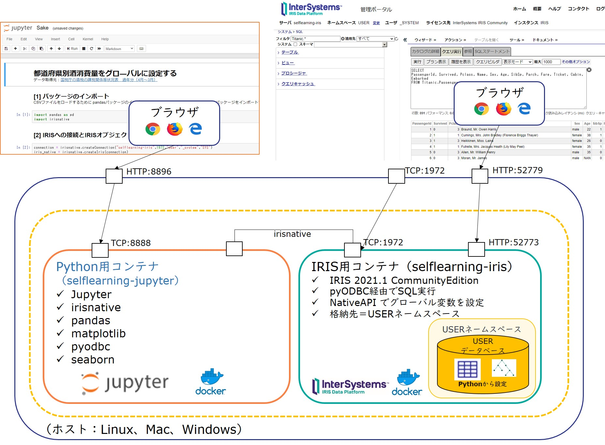

# PythonのNativeAPIに挑戦／PythonからPyODBCを使ってInterSystems IRISに接続してみよう

このサンプルは、InterSystems IRIS の Python 用 NativeAPIの使用方法を確認できるサンプルと PyODBC で IRIS へのアクセス方法を確認できるサンプルコードを含んだ jupyter のコンテナと IRIS のコンテナを作成します。

ビデオによる解説もご用意しています。詳しくは開発者コミュニティの以下記事をご参照ください。

- [【はじめての InterSystems IRIS】セルフラーニングビデオ：アクセス編：Python の NativeAPI に挑戦](https://jp.community.intersystems.com/node/478611)

- [【はじめての InterSystems IRIS】セルフラーニングビデオ：アクセス編：Python から PyODBC を使って IRIS に接続してみよう](https://jp.community.intersystems.com/node/478616)

> Docker、docker-compose、git が利用できる環境でお試しください。
またホストでサンプルを実行する場合は、Python3、pip のインストール、pyodbcの設定に必要な事前準備を行ってからお試しください（Linuxの場合は、 unixodbc のインストール、Windowsの場合は、InterSystems IRISのODBCドライバのインストール）。


**イメージ図**


IRIS のコンテナは、[InterSystems IRIS Community Edition のイメージ](https://hub.docker.com/_/intersystems-iris-data-platform)を使用しています（Pullできない場合はイメージ、タグ名ごご確認ください）。 

Jupyter のコンテナではなく、サンプルをダウンロードされたホストでもお試し頂けます（コードは[こちら](./Python/host-sample) ）。


## (1) コンテナを利用する場合

1. git clone 実行
    
    ```
    git clone https://github.com/Intersystems-jp/selflearning-python.git
    ```
    実行後、ディレクトリを移動します。

    ```
    cd selflearning-python
    ```

2. コンテナ開始

    ```
    docker-compose up -d --build
    ```
    jupyter の URL は以下の通りです（ウェブサーバ名は環境に合わせてご変更ください）。 

    http://localhost:8896

    サンプルコードは[こちら](./Python/jupyter-sample)にあります。

    IRIS の管理ポータルにアクセスする場合は以下の URL にアクセスします（ウェブサーバ名は環境に合わせてご変更ください）。

    http://localhost:52779/csp/sys/UtilHome.csp


3. コンテナ停止

    ```
    docker-compose stop
    ```

    - コンテナ破棄
        ```
        docker-compose down
        ```

## (2) ホストで実行する場合

ホストで実行する場合は事前に以下のインストールを行ってください。

- Python3
- pip

pyodbc モジュールのインポートのために以下のインストールが必要です。

Linux:
- unixodbc

Windows:
- IRIS の ODBC ドライバ（[こちら](https://github.com/Intersystems-jp/IRISModules/raw/master/python/ODBC-2021.1.0.215.0-win_x64.exe)からダウンロードしてください。）


ホストで実行を試す際、IRISコンテナに接続する場合は、以下実行してください（既に開始している場合は不要です）。

```
docker-compose up -d iris
```

### A) Linuxで実行する場合

以下の順序でサンプルコードが実行されます。

[HelloWorldNativeAPI.py](./Python/host-sample/HelloWorldNativeAPI.py)

[HelloWorldNativePyODBC.py](./Python/host-sample/HelloWorldPyODBC.py)

[Sake.py](./Python/host-sample/Sake.py)


1. サンプルに必要なモジュールをインポートします。

    ```
    cd Python/host-sample
    ./pipinstall-linux.sh 
    ```
    > 環境に合わせて適宜インストール内容を変更してお試しください（[pipinstall-linux.sh](./Python/host-sample/pipinstall-linux.sh)）。

2. サンプルの実行

    サンプルでは、IRISの接続に使用するホスト名を環境変数 IRISHOSTNAME に設定しています。

    localhost 以外の場合は、[host-params.sh](./Python/host-sample/host-params.sh) を修正してから以下実行してください。

    ```
    ./runhost.sh
    ```

### B) Windowsで実行する場合

以下の順序でサンプルコードが実行されます。

[HelloWorldNativeAPI.py](./Python/host-sample/HelloWorldNativeAPI.py)

[HelloWorldNativePyODBC.py](./Python/host-sample/HelloWorldPyODBC.py)

[Sake.py](./Python/host-sample/Sake.py)

1. サンプルに必要なモジュールをインポートします。
    ```
    cd Python/host-sample
    pipinstall-windows.bat 
    ```
    > 環境に合わせて適宜インストール内容を変更してお試しください（[pipinstall-windows.bat](./Python/host-sample/pipinstall-windows.bat)）。

2. サンプルの実行

    サンプルでは、IRISの接続に使用するホスト名を環境変数 IRISHOSTNAME に設定しています。

    localhost 以外の場合は、[host-params.bat](./Python/host-sample/host-params.bat) を修正してから以下実行してください。

    ```
    runhost.bat
    ```


